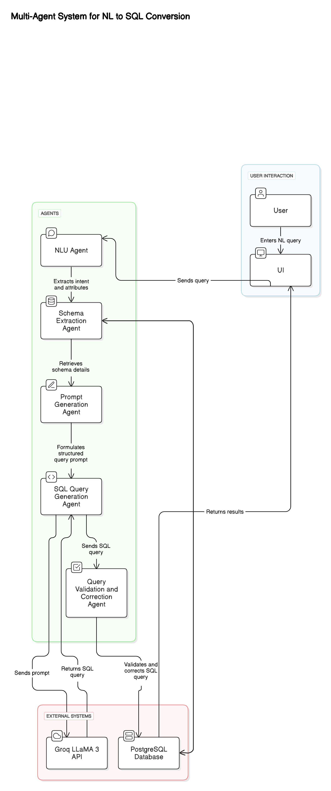

# Project: Natural Language to SQL Conversion

## Overview

This project converts natural language queries into SQL queries using AI-driven processing. It extracts user intent, retrieves database schema, generates optimized SQL queries, and validates them.

## Features

- **Natural Language Understanding (NLU) Agent:** Extracts user intent, attributes, and filtering conditions from a natural language query.
- **Schema Extraction Agent:** Connects to PostgreSQL and retrieves detailed schema information, including tables, columns, data types, and primary keys.
- **Prompt Generation Agent:** Structures a prompt using NL query and database schema for AI processing.
- **SQL Query Generation Agent:** Uses Groq API to generate SQL queries based on structured prompts.
- **Query Validation & Correction Agent:** Ensures generated SQL queries adhere to the schema and corrects errors automatically.
- **Streamlit UI for Access:** Provides a web interface for users to input queries and receive SQL outputs.

## Technologies Used

- **Programming Language:** Python
- **Database:** PostgreSQL
- **API Service:** Groq AI API
- **Libraries:**
  - `requests`: API calls
  - `json`: Parsing API responses
  - `psycopg2`: PostgreSQL database interactions
  - `re`: Regex for text processing
  - `streamlit`: Web-based UI

## Installation & Setup

1. Clone the repository:
   ```sh
   git clone https://github.com/GarbhitSh/Rigger-
   cd <project-directory>
   ```
2. Install required dependencies:
   ```sh
   pip install requests psycopg2 streamlit
   ```
3. Update PostgreSQL credentials in `DB_CONFIG`.
4. Replace `GROQ_API_KEY` with a valid API key.
5. Run the script:
   ```sh
   python main.py
   ```
6. Run the Streamlit UI:
   ```sh
   streamlit run app.py
   ```

## Execution Flow

1. **Extract NLU Information** → Understands query intent and filters.
2. **Fetch Database Schema** → Retrieves table structures from PostgreSQL.
3. **Generate AI Prompt** → Converts NL query into an AI-friendly prompt.
4. **Generate SQL Query** → Calls Groq API to create SQL query.
5. **Validate & Correct SQL** → Ensures query correctness against schema.
6. **Output the Final SQL Query**.

## Example

### Input:

```
Retrieve the loyalty_program_tier_level of customers who have reviewed a product referenced_product_identifier = 12345. Provide the review_unique_identifier and associated_review_image_urls.
```

### Output:

```sql
SELECT loyalty_program_tier_level, review_unique_identifier, associated_review_image_urls
FROM customer_reviews
WHERE referenced_product_identifier = 12345;
```

## Streamlit UI Access
A Streamlit-based UI is available for easy interaction with the system.

### Running the UI:
Run the following command:
```sh
streamlit run app.py
```

### UI Features:
- Text area for entering natural language queries
- Button to generate SQL queries
- Displays both generated and validated SQL queries

## License

This project is licensed under the MIT License.

## System design



